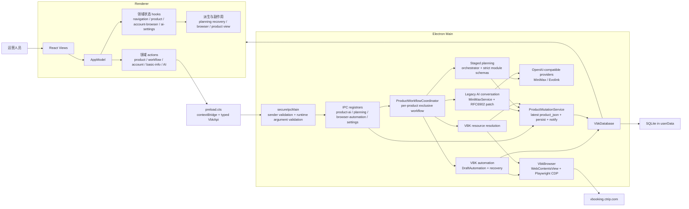
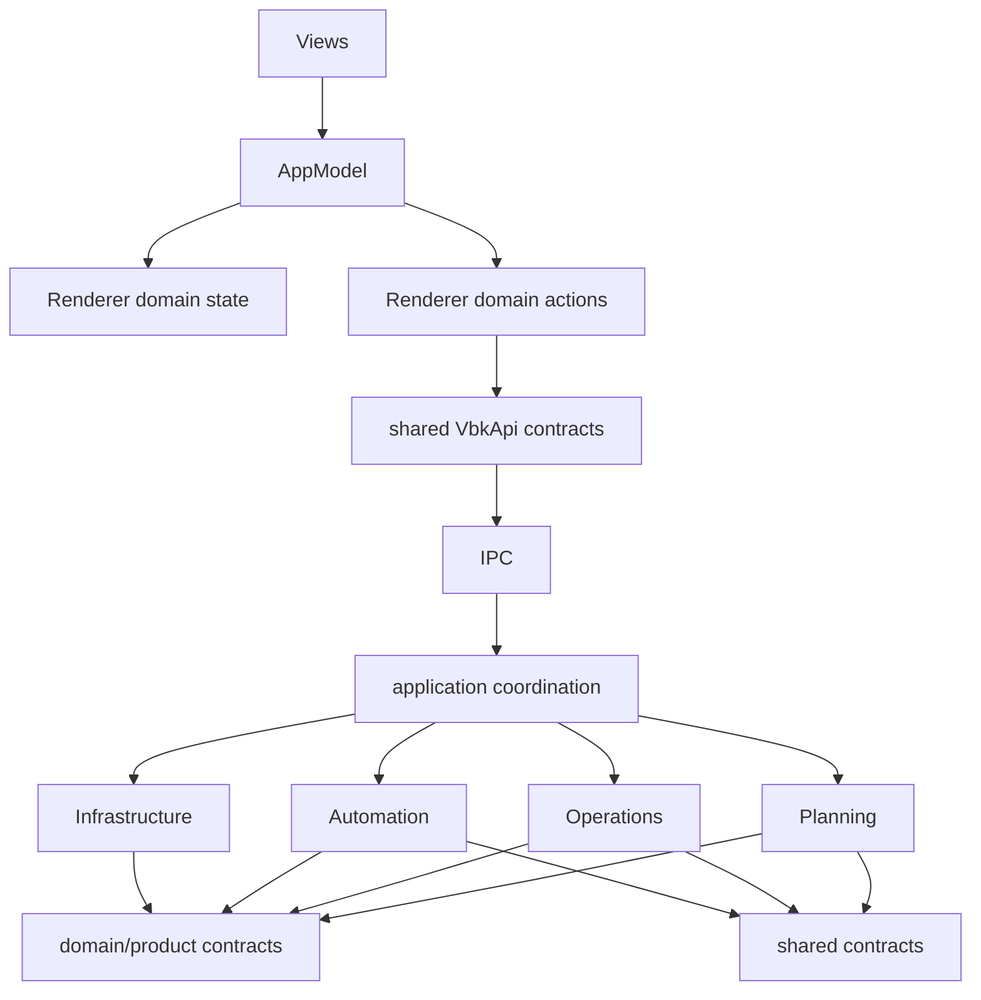
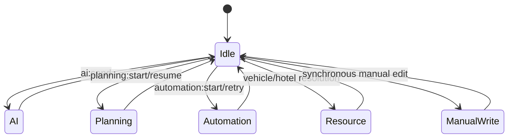
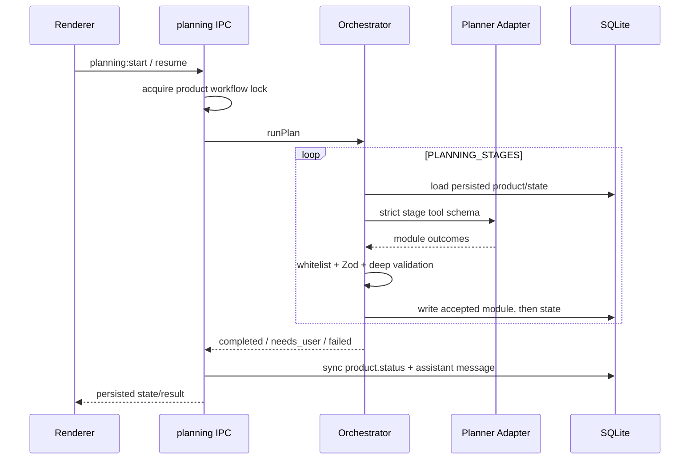

# VBK Desktop 架构（当前实现）

> 本文是仓库架构的单一入口，基于 2026-08-13 的源码逐文件审计与调整结果。
> `PRODUCT.md` 描述产品目标，`DESIGN.md` 描述视觉交互；本文只描述代码边界、数据真相、运行流与验收。

## 1. 系统总图



系统终点始终是“保存 VBK 草稿”。提审与发布必须由运营人员在 VBK 中完成。

## 2. 依赖方向



强制规则：

- `planning`、`data` 不得反向依赖 `automation` 工作流层。
- 推荐理由分类只在 `main/domain/product/recommendation-categories.ts` 定义一次。
- `planning/schemas.ts` 与 `planning/tool-schema.ts` 不得互相导入；二者只依赖 `stage-contract.ts`。
- Renderer 不直接访问 Electron 或数据库，只通过 preload 暴露的 `window.vbk`。
- 所有业务 IPC 只能通过 `secureIpcMain` 注册，先校验 sender，再校验运行时参数。
- 新的跨层依赖必须同步扩展 `test/infrastructure/architecture-boundaries.test.ts`。

## 3. 目录职责

```text
src/
  main/
    application/              跨工作流协调与统一产品写入
      product-workflow-coordinator.ts
      product-mutation-service.ts
    domain/product/           与 planning/automation 无关的产品领域常量
    ipc/                      IPC 装配，不承载页面选择器或 SQL
    planning/                 分阶段结构化规划、续跑、POI 回填、深校验
    minimax/                  OpenAI-compatible 对话、解析、错误归类
    operations/               产品 patch、人工字段、封面/酒店/车辆等业务操作
    automation/               VBK 页面自动录入、恢复、重试、停止
    infrastructure/           SQLite、BrowserView/CDP、IPC 安全、凭据文件、远端查询
    main.ts                   进程启动与依赖装配
    preload.cts               contextBridge
  renderer/
    app/state/domains/        navigation/product/account-browser/ai-settings 原始状态
    app/state/derived.ts      高风险 planning 恢复状态机
    app/state/domains/*-derived.ts  浏览器与产品视图派生
    app/actions/              按业务域封装 IPC 调用
    app/views/                页面和展示组件
  shared/                     main/renderer 双端共享类型、IPC、规划契约
```

## 4. 数据真相与状态边界

| 数据 | 权威来源 | Renderer 角色 |
| --- | --- | --- |
| 产品内容 | `products.product_json` | 缓存并展示，写入后等待 `product:updated` |
| 产品生命周期 | `products.status` | 展示，不自行推断持久化终态 |
| 规划进度 | `planning_generation.state_json` | `planning:updated` 实时订阅，`planning:state` 首次补偿 |
| 自动化进度 | `automation_runs.payload_json` | 展示阶段、失败与恢复入口 |
| 消息 | `messages` | 展示 taskStatus；running/failed 不伪装成功 |
| 核查任务 | `research_tasks` | 展示和触发确认/资源解析 |
| AI Key | userData 下 0600 权限的本地 JSON 文件 | 只能看到 `hasKey`，永不读回明文 |
| VBK 登录 | Electron 持久 partition + 0600 session 文件 | 只看账号摘要，不接收 cookie 值 |

`product_json` 是产品内容的唯一真相。规划阶段的“accepted”必须从已持久化产品反推，不能只信任内存 accumulator 或模型回复。

## 5. 同一产品的写入互斥



`ProductWorkflowCoordinator` 在主进程按 `localProductId` 持锁：

- 同一产品的 AI、planning、automation、resource resolution 不可并发。
- 手工 JSON/复核字段写入会在长流程运行时被拒绝。
- 不同产品可以并行。
- 锁在 `finally` 释放，失败不会造成永久占用。

`ProductMutationService.applyAiPatch()` 会在提交时重新读取最新 `product_json`，然后应用 patch；禁止使用 AI 请求开始时的旧对象整包覆盖。

## 6. 两条 AI 能力如何共存

### 6.1 Staged planning（新产品主路径）



阶段及允许模块由 `planning/stage-contract.ts` 定义；工具 schema 和值校验分别在 `tool-schema.ts`、`schemas.ts`，模块写入路径由 `AI_WRITABLE_PATHS` 限定。

### 6.2 Legacy AI conversation（兼容多轮微调）

`ai:send` 仍保留多轮自然语言微调能力：模型返回 RFC6902 patch，`applyProductPatchSafe` 拒绝禁写路径并做兼容归一化，最后通过 `ProductMutationService` 基于最新产品提交。

两条路径不再同时写同一产品，但输出协议仍不同。未来若移除 legacy，必须先迁移 renderer 对话行为与历史消息兼容，不能直接删除。

## 7. VBK 自动化

自动化由 `DraftAutomation` 负责，使用 Playwright 连接 Electron 内嵌的已登录页面。典型阶段：

```text
basic → presentation → itinerary → package
      → [pricingInventory] → [hotelResource] → [vehicleResource]
      → [terms] → preflight
```

阶段由产品数据动态决定。每次异步边界都必须重新读取真实 DOM/持久化状态；HTTP 200、截图或 fixture 不能单独证明业务成功。停止操作不强杀 in-flight Playwright 调用，而是在安全 checkpoint 结束。

## 8. IPC 边界

调用链固定为：

```text
renderer action → window.vbk → preload ipcRenderer.invoke
→ secureIpcMain(sender + args) → registrar handler → application/domain/infrastructure
```

集中运行时校验覆盖产品 ID、创建 payload、AI 文本、产品 JSON 大小、自动化阶段、浏览器 bounds/URL、账号关键字与 providerId。TypeScript 类型不能替代这一层，因为 IPC payload 在运行时是不可信的 `unknown`。

## 9. 本次审计发现与调整

| 原问题 | 风险 | 当前调整 |
| --- | --- | --- |
| planning/data 依赖 automation schema | 业务层反向依赖，难独立演进 | 产品分类抽到 `domain/product` |
| `schemas.ts ↔ tool-schema.ts` 循环 | 初始化顺序与测试耦合 | `stage-contract.ts` 单向共享 |
| AI 与 planning 两条写路径无共同互斥 | 旧快照覆盖、重复消息/状态 | 产品级 `ProductWorkflowCoordinator` |
| AI 网络返回后覆盖请求开始时的旧产品 | 丢失运营手工修改 | 提交时重读最新产品再 patch |
| 产品写入、广播散落 | 落盘/通知顺序不一致 | `ProductMutationService` |
| IPC sender 校验靠人工记忆 | 新 handler 容易漏防线 | 统一 `secureIpcMain` 门面 |
| IPC 只有 TypeScript 类型 | 运行时可传任意 payload | 集中 `validateIpcArguments` |
| Renderer 单一大状态袋 | 跨域重渲染与修改困难 | 四个领域 state hooks + 分离 derived |
| basic-info 同时处理字段、搜索、图片转换 | 文件过大且职责混杂 | 封面 model/search 独立模块 |
| 架构文档描述旧路径与 safeStorage | 运维/开发判断错误 | 本文按当前源码重写 |

## 10. 仍需关注的风险

- `minimax/minimax-parsing.ts`、`infrastructure/ctrip-library-search.ts`、`vbk-browser.ts`、`shared/contracts-types.ts` 仍明显偏大；应按解析阶段、远端 endpoint、浏览器生命周期、契约领域继续拆分。
- `renderer/state/derived.ts` 保留了约 400 行的 planning 恢复状态机。它是高风险集中逻辑，下一次拆分必须先增加 hook 级行为测试，不能只做文本搬移。
- Legacy AI 与 staged planning 仍有两种模型输出协议。当前通过互斥和统一落盘控制风险，但还不是单一生成协议。
- 真实 VBK 页面、接口 payload、选择器和账号配置会漂移；离线测试与构建不等于真实录入成功。
- `operation-log-store` 仍应确认是否满足长期持久化和审计需求。

## 11. 验收层级

1. 静态边界：`git diff --check`、架构依赖测试、IPC 覆盖测试。
2. 类型与单元：`npm run check`、focused tests。
3. 全量回归：`npm test`。
4. 打包路径：`npm run build`。
5. Electron smoke：主进程启动、窗口/preload/renderer 加载，无启动异常。
6. 真实 VBK smoke：使用已登录账号和专用测试产品，验证真实 DOM 提交、持久化 run state 与远端草稿；没有这一步时必须明确标记“未做真实 VBK 证明”。

最终交付不得把第 1～4 层描述成第 6 层成功。
