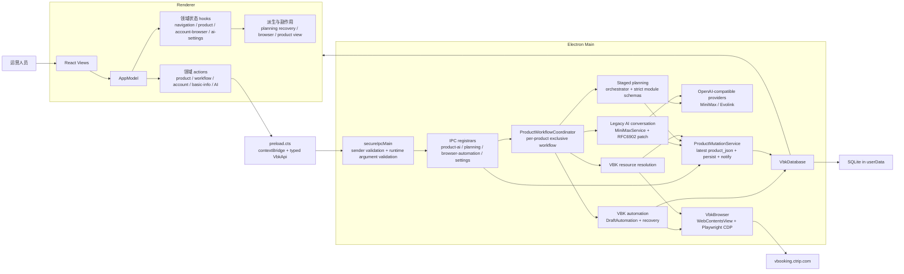
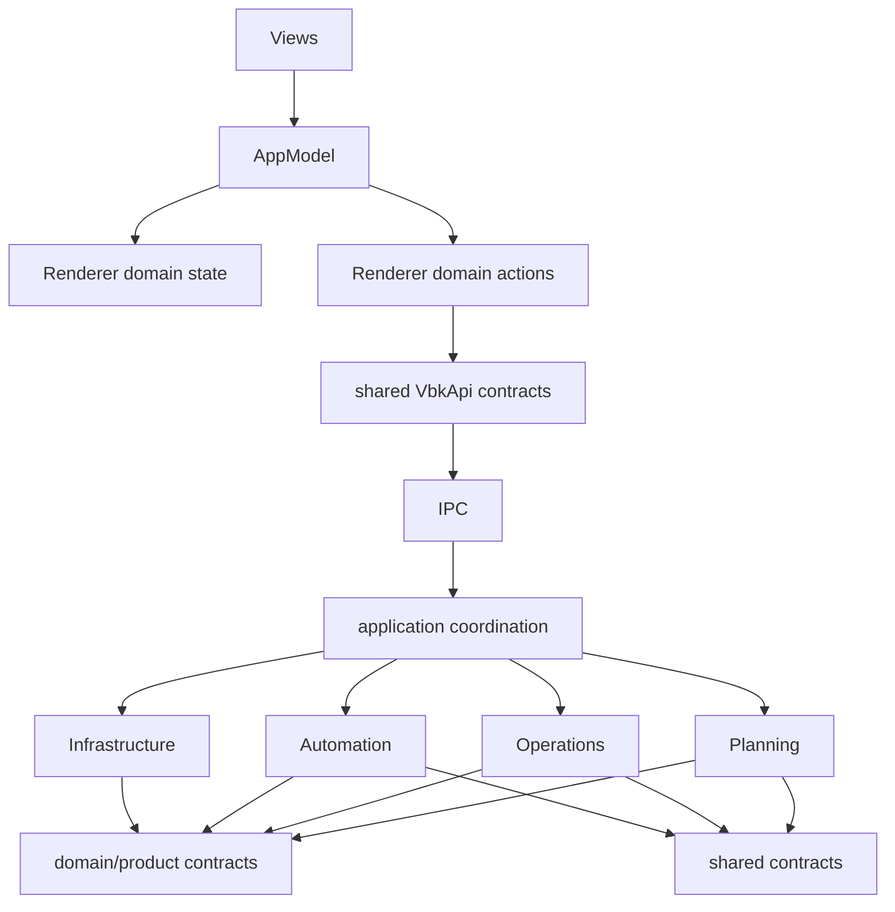
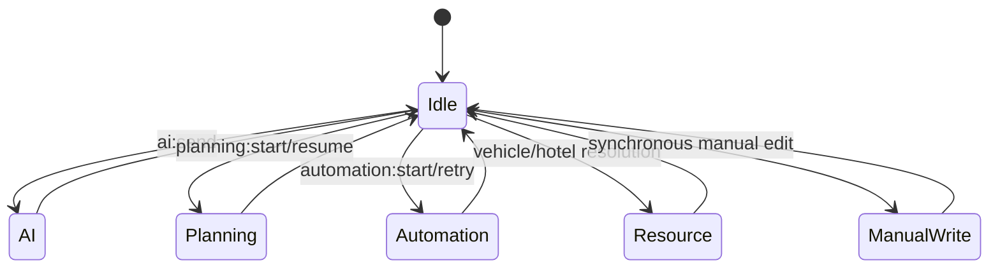
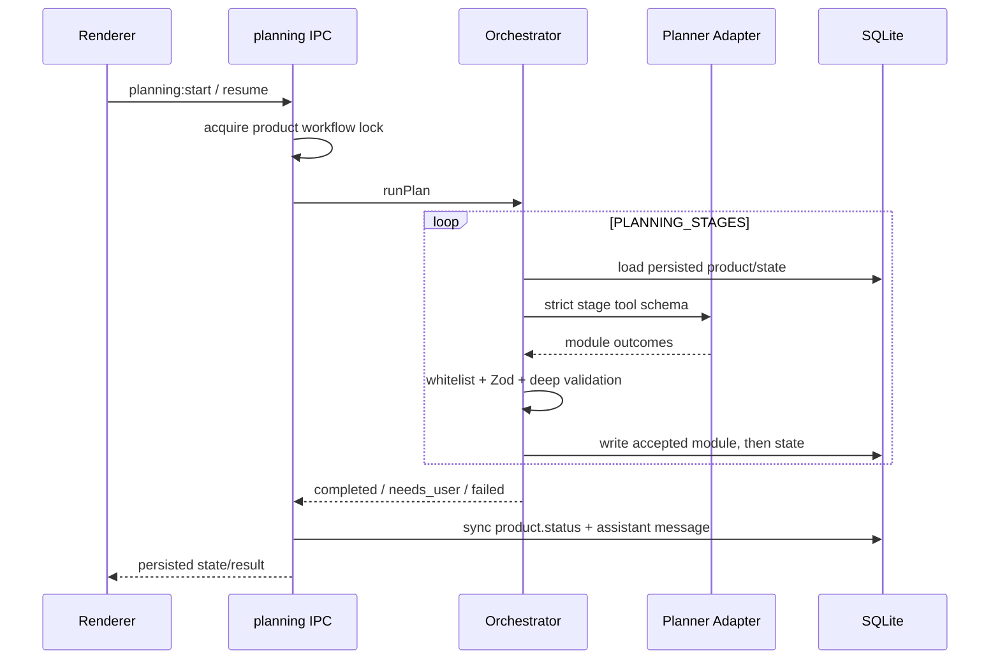
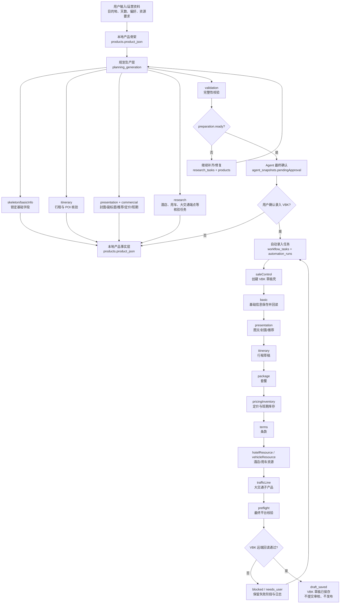
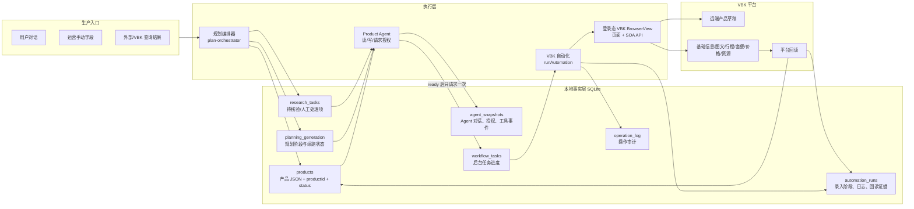
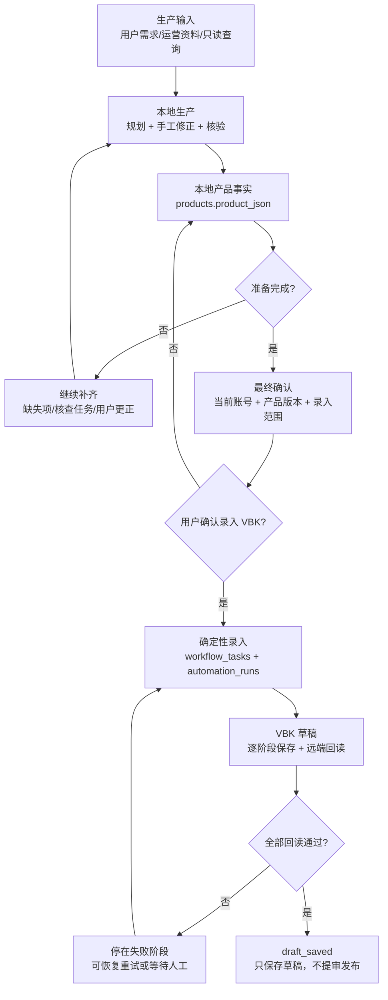
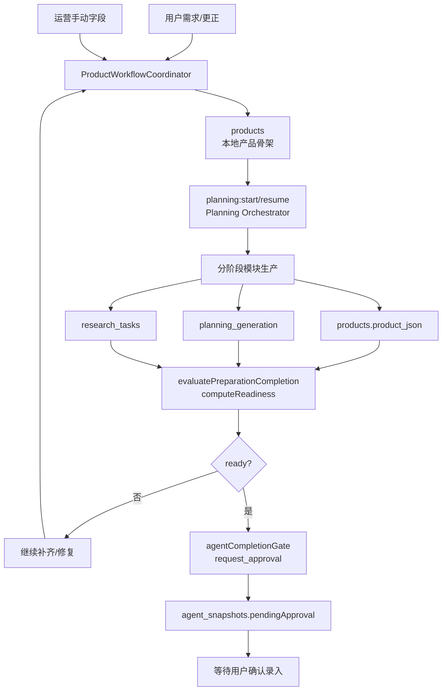
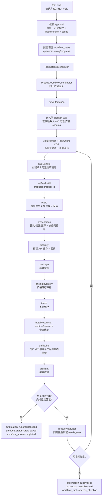

# VBK Desktop 架构（当前实现）

> 本文是仓库架构的单一入口，基于 2026-08-13 的源码逐文件审计与调整结果。
> `PRODUCT.md` 描述产品目标，`DESIGN.md` 描述视觉交互；本文只描述代码边界、数据真相、运行流与验收。

## 1. 系统总图



系统终点始终是“保存 VBK 草稿”。提审与发布必须由运营人员在 VBK 中完成。

## 2. 依赖方向



强制规则：

- `planning`、`data` 不得反向依赖 `automation` 工作流层。
- 推荐理由分类只在 `main/domain/product/recommendation-categories.ts` 定义一次。
- `planning/schemas.ts` 与 `planning/tool-schema.ts` 不得互相导入；二者只依赖 `stage-contract.ts`。
- Renderer 不直接访问 Electron 或数据库，只通过 preload 暴露的 `window.vbk`。
- 所有业务 IPC 只能通过 `secureIpcMain` 注册，先校验 sender，再校验运行时参数。
- 新的跨层依赖必须同步扩展 `test/infrastructure/architecture-boundaries.test.ts`。

## 3. 目录职责

```text
src/
  main/
    application/              跨工作流协调与统一产品写入
      product-workflow-coordinator.ts
      product-mutation-service.ts
    domain/product/           与 planning/automation 无关的产品领域常量
    ipc/                      IPC 装配，不承载页面选择器或 SQL
    planning/                 分阶段结构化规划、续跑、POI 回填、深校验
    minimax/                  OpenAI-compatible 对话、解析、错误归类
    operations/               产品 patch、人工字段、封面/酒店/车辆等业务操作
    automation/               VBK 页面自动录入、恢复、重试、停止
    infrastructure/           SQLite、BrowserView/CDP、IPC 安全、凭据文件、远端查询
    main.ts                   进程启动与依赖装配
    preload.cts               contextBridge
  renderer/
    app/state/domains/        navigation/product/account-browser/ai-settings 原始状态
    app/state/derived.ts      高风险 planning 恢复状态机
    app/state/domains/*-derived.ts  浏览器与产品视图派生
    app/actions/              按业务域封装 IPC 调用
    app/views/                页面和展示组件
  shared/                     main/renderer 双端共享类型、IPC、规划契约
```

## 4. 数据真相与状态边界

| 数据 | 权威来源 | Renderer 角色 |
| --- | --- | --- |
| 产品内容 | `products.product_json` | 缓存并展示，写入后等待 `product:updated` |
| 产品生命周期 | `products.status` | 展示，不自行推断持久化终态 |
| 规划进度 | `planning_generation.state_json` | `planning:updated` 实时订阅，`planning:state` 首次补偿 |
| 自动化进度 | `automation_runs.payload_json` | 展示阶段、失败与恢复入口 |
| 消息 | `messages` | 展示 taskStatus；running/failed 不伪装成功 |
| 核查任务 | `research_tasks` | 展示和触发确认/资源解析 |
| AI Key | userData 下 0600 权限的本地 JSON 文件 | 只能看到 `hasKey`，永不读回明文 |
| VBK 登录 | Electron 持久 partition + 0600 session 文件 | 只看账号摘要，不接收 cookie 值 |

`product_json` 是产品内容的唯一真相。规划阶段的“accepted”必须从已持久化产品反推，不能只信任内存 accumulator 或模型回复。

## 5. 同一产品的写入互斥



`ProductWorkflowCoordinator` 在主进程按 `localProductId` 持锁：

- 同一产品的 AI、planning、automation、resource resolution 不可并发。
- 手工 JSON/复核字段写入会在长流程运行时被拒绝。
- 不同产品可以并行。
- 锁在 `finally` 释放，失败不会造成永久占用。

`ProductMutationService.applyAiPatch()` 会在提交时重新读取最新 `product_json`，然后应用 patch；禁止使用 AI 请求开始时的旧对象整包覆盖。

## 6. 两条 AI 能力如何共存

### 6.1 Staged planning（新产品主路径）



阶段及允许模块由 `planning/stage-contract.ts` 定义；工具 schema 和值校验分别在 `tool-schema.ts`、`schemas.ts`，模块写入路径由 `AI_WRITABLE_PATHS` 限定。

### 6.2 Legacy AI conversation（兼容多轮微调）

`ai:send` 仍保留多轮自然语言微调能力：模型返回 RFC6902 patch，`applyProductPatchSafe` 拒绝禁写路径并做兼容归一化，最后通过 `ProductMutationService` 基于最新产品提交。

两条路径不再同时写同一产品，但输出协议仍不同。未来若移除 legacy，必须先迁移 renderer 对话行为与历史消息兼容，不能直接删除。

## 7. VBK 自动化

自动化由 `DraftAutomation` 负责，使用 Playwright 连接 Electron 内嵌的已登录页面。典型阶段：

```text
basic → presentation → itinerary → package
      → [pricingInventory] → [hotelResource] → [vehicleResource]
      → [terms] → preflight
```

阶段由产品数据动态决定。每次异步边界都必须重新读取真实 DOM/持久化状态；HTTP 200、截图或 fixture 不能单独证明业务成功。停止操作不强杀 in-flight Playwright 调用，而是在安全 checkpoint 结束。

## 8. IPC 边界

调用链固定为：

```text
renderer action → window.vbk → preload ipcRenderer.invoke
→ secureIpcMain(sender + args) → registrar handler → application/domain/infrastructure
```

集中运行时校验覆盖产品 ID、创建 payload、AI 文本、产品 JSON 大小、自动化阶段、浏览器 bounds/URL、账号关键字与 providerId。TypeScript 类型不能替代这一层，因为 IPC payload 在运行时是不可信的 `unknown`。

## 9. 本次审计发现与调整

| 原问题 | 风险 | 当前调整 |
| --- | --- | --- |
| planning/data 依赖 automation schema | 业务层反向依赖，难独立演进 | 产品分类抽到 `domain/product` |
| `schemas.ts ↔ tool-schema.ts` 循环 | 初始化顺序与测试耦合 | `stage-contract.ts` 单向共享 |
| AI 与 planning 两条写路径无共同互斥 | 旧快照覆盖、重复消息/状态 | 产品级 `ProductWorkflowCoordinator` |
| AI 网络返回后覆盖请求开始时的旧产品 | 丢失运营手工修改 | 提交时重读最新产品再 patch |
| 产品写入、广播散落 | 落盘/通知顺序不一致 | `ProductMutationService` |
| IPC sender 校验靠人工记忆 | 新 handler 容易漏防线 | 统一 `secureIpcMain` 门面 |
| IPC 只有 TypeScript 类型 | 运行时可传任意 payload | 集中 `validateIpcArguments` |
| Renderer 单一大状态袋 | 跨域重渲染与修改困难 | 四个领域 state hooks + 分离 derived |
| basic-info 同时处理字段、搜索、图片转换 | 文件过大且职责混杂 | 封面 model/search 独立模块 |
| 架构文档描述旧路径与 safeStorage | 运维/开发判断错误 | 本文按当前源码重写 |

## 10. 仍需关注的风险

- `minimax/minimax-parsing.ts`、`infrastructure/ctrip-library-search.ts`、`vbk-browser.ts`、`shared/contracts-types.ts` 仍明显偏大；应按解析阶段、远端 endpoint、浏览器生命周期、契约领域继续拆分。
- `renderer/state/derived.ts` 保留了约 400 行的 planning 恢复状态机。它是高风险集中逻辑，下一次拆分必须先增加 hook 级行为测试，不能只做文本搬移。
- Legacy AI 与 staged planning 仍有两种模型输出协议。当前通过互斥和统一落盘控制风险，但还不是单一生成协议。
- 真实 VBK 页面、接口 payload、选择器和账号配置会漂移；离线测试与构建不等于真实录入成功。
- `operation-log-store` 仍应确认是否满足长期持久化和审计需求。

## 11. 验收层级

1. 静态边界：`git diff --check`、架构依赖测试、IPC 覆盖测试。
2. 类型与单元：`npm run check`、focused tests。
3. 全量回归：`npm test`。
4. 打包路径：`npm run build`。
5. Electron smoke：主进程启动、窗口/preload/renderer 加载，无启动异常。
6. 真实 VBK smoke：使用已登录账号和专用测试产品，验证真实 DOM 提交、持久化 run state 与远端草稿；没有这一步时必须明确标记“未做真实 VBK 证明”。

最终交付不得把第 1～4 层描述成第 6 层成功。

## 12. 产品生产到 VBK 录入总链路

这条链路分成五段：生产入口、本地方案、最终授权、VBK 录入、平台回读。关键原则是本地产品内容、任务/Agent 状态、VBK 平台事实三者分层管理，不能用其中任意一层单独判断整条链路完成。



### 12.1 分层视图



### 12.2 状态边界

| 状态/数据 | 职责 | 不能替代什么 |
| --- | --- | --- |
| `products.product_json` | 本地产品内容事实，保存基础信息、行程、图文、套餐、价格、班期、酒店候选、用车和大交通配置 | 不能证明 VBK 已写入 |
| `planning_generation` | 规划生产进度与续跑状态 | 不能只看 `status=completed` 就判定准备完成，仍要看阶段和 validation |
| `research_tasks` | POI、资源、人工核验等审查交接项 | 不能被删除来绕过 readiness |
| `agent_snapshots` | Agent 对话、工具调用、最终授权、可恢复上下文 | 不能用 Agent 文案替代实际落库或远端回读 |
| `workflow_tasks` | 用户确认后的后台任务壳和 UI 进度 | 不能证明单个 VBK 阶段成功 |
| `automation_runs.payload_json` | VBK 录入阶段、失败原因、重试记录和回读证据 | 不能替代平台最新页面/接口事实 |
| `operation_log` | 排障与审计证据 | 不能作为业务成功的唯一依据 |

### 12.3 完成判定

1. 本地准备完成不等于 VBK 已录入。
2. VBK 有 `productId` 只说明远端草稿壳可能已创建，不等于整条录入完成。
3. 最终授权只在 `preparation.ready=true` 后出现一次。
4. 授权后写 VBK 走确定性自动化阶段，不再让模型自由决定写哪些模块。
5. 录入完成必须有远端回读证据，尤其是 basic、图文、行程、资源和大交通子产品。
6. 自动化终点是 `draft_saved`，不会自动提审或发布。

### 12.4 整体简版：确认前与确认后

整体上，系统先把产品方案生产成“可录入的本地事实”，再等用户确认后把这份事实确定性写入 VBK 草稿。



| 阶段 | 一句话目标 | 主要事实来源 | 结束条件 |
| --- | --- | --- | --- |
| 确认前 | 把用户想法和运营资料生产成一份可录入产品方案 | `products`、`planning_generation`、`research_tasks`、`agent_snapshots` | `preparation.ready=true`，并生成一次最终确认 |
| 确认后 | 把已确认方案写入 VBK 草稿并逐阶段回读 | `workflow_tasks`、`automation_runs`、`products`、VBK 远端页面/API | `automation_runs=succeeded` 且 `products.status=draft_saved` |

### 12.5 模块详版：用户确认 VBK 录入前

确认前的目标是把“可以录入的产品方案”生产出来，并把所有不确定项沉淀为可见的阻断或审查交接。这个阶段允许 AI 生成、运营手动修正、VBK/公开接口只读核验，但不允许写入 VBK 产品草稿。



确认前按模块看：

| 模块 | 输入 | 输出 | 责任边界 |
| --- | --- | --- | --- |
| `planning:start/resume` | 用户需求、已有 `product_json`、历史规划状态 | 分阶段模块结果、`planning_generation` | 只生产本地方案，不写 VBK |
| `plan-orchestrator` | `PlanningSkeleton`、Planner adapter、持久化产品 | `basicInfo`、`itinerary`、`presentation`、`commercial` 等模块 | 已完成阶段不重复跑；完成态仍要 deep validation |
| `ProductMutationService` | AI patch 或运营手动字段 | 最新 `products.product_json` | 提交时重新读最新产品，避免旧快照覆盖 |
| POI/资源核验 | VBK/携程只读查询、公开接口、运营输入 | 已绑定 ID、候选、或 `research_tasks` | 查不到不能硬写假 ID；可保留人工交接 |
| `evaluatePreparationCompletion` | 产品、核查任务、Agent 快照 | `ready`、当前阶段/节点、缺失项、允许动作 | `ready=false` 时禁止 `request_approval` |
| `agentCompletionGate` | readiness、准备度评估、Agent 快照 | `pendingApproval` 或继续补齐提示 | 未发生远端写入前，只能生成最终确认，不算完成 |

确认前的生产模块：

| 生产模块 | 负责内容 | 持久化位置 |
| --- | --- | --- |
| `skeleton/basicInfo` | 目的地、天数晚数、产品形态、行政地点短名、默认安全配置 | `products.product_json`、`planning_generation` |
| `itinerary` | 每日行程、餐食、住宿意图、用户明确指定内容 | `products.product_json` |
| `POI resolver` | POI 候选、同城兜底、ID 绑定、无法确认项 | `products.product_json`、`research_tasks` |
| `presentation` | 副标题、产品特色、推荐理由、封面来源和 POI 元数据 | `products.product_json` |
| `commercial` | 本地指导价、库存班期、套餐名称、默认条款材料 | `products.product_json` |
| `resource research` | 酒店候选、用车资源建议、大交通端点可用性 | `products.product_json`、`research_tasks` |
| `validation` | 从持久化产品反推完整性，定位最早失效阶段 | `planning_generation`、readiness 结果 |

确认前的持久化读写顺序：

1. 创建或读取 `products`，获得本地 `localProductId` 和当前 `product_json`。
2. `planning_generation` 记录当前规划阶段、已完成阶段、失败/待用户处理状态。
3. 每个 accepted 模块写回 `products.product_json`，再更新规划状态。
4. 不能自动确定的景点、酒店、资源、端点问题写入 `research_tasks`。
5. Agent 对话、工具事件、准备度结果和待确认授权写入 `agent_snapshots`。
6. Renderer 只展示这些持久化结果；不能用模型回复文本或 UI 百分比当完成证据。

确认前的出入口规则：

- 入口可以来自新建产品、继续规划、Agent 对话、运营手动改字段。
- 明确的用户更正优先修复未提交草稿，例如“改成 4 天 3 晚”；已提交或正在录入的产品不能被静默重写。
- 商业价格是本地指导价生成，不向运营反问成人价、儿童价、起订人数或成本。
- 大交通在规划阶段只确认端点，班期/资源验证推迟到 VBK 子产品阶段。
- `patch_product` 不能写入新增或改名 POI ID；必须走统一 POI resolver。
- 唯一的确认问题是“要不要往 VBK 里录入”；在此之前所有结果都仍是本地准备。

确认前的完成标准：

| 检查项 | 必须满足 |
| --- | --- |
| 基础信息 | 目的地、出发/目的城市短名、天数晚数、产品形态、负责人/必要账号固定信息可用 |
| 行程 | 每日结构完整；用户指定景点被保留；POI 可解析或形成明确交接 |
| 图文 | 副标题、特色、推荐理由、封面来源和 POI 元数据满足 VBK 合同 |
| 商业 | 套餐名、价格、库存班期、条款默认值齐备 |
| 资源 | 酒店候选、用车资源建议、大交通端点核验按产品形态完成 |
| 状态 | `planning_generation` 全阶段完成且 validation 通过；`research_tasks` 无阻断项；`preparation.ready=true` |

### 12.6 模块详版：用户确认 VBK 录入后

确认后进入确定性写入阶段。此时模型不再决定“写什么”，只允许系统按已授权范围把当前方案写成 VBK 草稿，并在每个阶段保存本地状态、处理可恢复失败、执行远端回读。



确认后按模块看：

| 模块 | 输入 | 输出 | 责任边界 |
| --- | --- | --- | --- |
| `AgentSnapshotManager.validApproval` | 当前账号、产品指纹、意图版本、scope | 有效授权或拒绝写入 | 授权过期、换账号、产品变更都要重新确认 |
| `workflow_tasks` | 用户确认动作和本地产品 ID | 后台任务状态、阶段、进度、错误 | UI 任务壳，不代表 VBK 阶段已成功 |
| `ProductTaskScheduler` | queued/resume/retry 请求 | 调度规划或自动化执行 | 应复用持久化任务，不绕过互斥与阶段状态 |
| `runAutomation` | 已授权产品方案、当前 VBK 会话 | `automation_runs`、`productId`、`draft_saved` 或 `blocked` | 只保存草稿，不提审、不发布 |
| `runPhaseWithRecovery` | 阶段 handler、失败证据、恢复策略 | 自动重试、停住等待用户、失败日志 | 同一阶段可恢复；不能跨阶段盲目重跑 |
| VBK API/Page handlers | `product_json`、`productId`、登录态 | 单阶段保存结果和远端回读 | HTTP 200 不等于成功，必须读取业务结果 |

确认后的录入模块：

| 录入模块 | 写入内容 | 成功证据 |
| --- | --- | --- |
| `saleControl` | 产品类型、形态、线路品牌、分销渠道，创建远端草稿壳 | 读到 VBK `productId`，并写回 `products.product_id` |
| `basic` | 基础信息、供应商编号、目的地、负责人、400 电话等 | 保存成功并完成远端回读；随后置位 `basicInfoSaved` |
| `presentation` | 产品特色、封面、推荐理由、图文文案 | 页面/API 回读一致；敏感词失败要按受影响字段重写 |
| `itinerary` | 每日行程、景点、接送站/交通相关信息 | 行程保存后从 VBK 读回结构化结果 |
| `package` | 套餐、出行人资料配置、套餐可售基础设置 | 套餐保存成功并可进入后续价格库存 |
| `pricingInventory` | 价格、库存、班期 | 批量保存结果与平台回读一致 |
| `terms` | 费用包含/不含、预订须知、退改等条款 | 目标条款项保存后重新读取仍被选中或内容一致 |
| `hotelResource` | 酒店平台资源绑定或候选镜像 | 平台资源 ID/名称/每日候选回填为自动化镜像 |
| `vehicleResource` | 用车资源组绑定 | VBK 返回的资源组 ID/名称回填，价格文本不当成 API 价格 |
| `trafficLine` | 大交通子产品、segment、子资源 | 子产品完成 formal segments 和 finalReadback |
| `preflight` | 聚合校验 | 授权范围内阶段均可从平台侧读回 |

确认后的数据写入规则：

| 写入点 | 写什么 | 成功证据 |
| --- | --- | --- |
| `products.product_id` | VBK 远端草稿 ID | `saleControl` 创建/进入成功并读到产品 ID |
| `products.basic_info_saved` | basic 已保存标记 | 基础信息 API 保存并完成远端回读 |
| `products.product_json.automation` | 自动化阶段镜像、资源回填、交通子产品 checkpoint | 对应阶段 handler 的业务回读 |
| `automation_runs.payload_json` | run 状态、phase 状态、logs、recovery、trafficLine checkpoint | 每个阶段运行中持续保存 |
| `workflow_tasks` | 任务进度和最终状态 | scheduler 根据自动化终态更新 |
| `operation_log` | 阶段级审计记录 | 用于排障，不单独代表业务成功 |

确认后的失败处理：

- 页面状态异常、选择器漂移、平台弹窗、敏感词、资源缺失等先记录在 `automation_runs.payload_json`。
- 可恢复失败由 `runPhaseWithRecovery` 在同一阶段重试；重试前重新进入目标模块页，避免复用脏页面状态。
- 连续失败或需要人工处理时，产品进入 `blocked`，任务进入 `needs_attention`，UI 展示具体阶段和处理建议。
- 恢复时优先从失败阶段继续；已有远端回读通过的阶段不应重复写。
- 诊断时证据优先级是远端回读和 phase log 高于 `products.status`，再高于 `workflow_tasks` 和 Agent 文案。

确认后的完成标准：

| 检查项 | 必须满足 |
| --- | --- |
| 授权 | 当前账号、产品版本、意图版本、scope 与确认时一致 |
| 阶段 | 授权范围内 phase 均为 completed 或有明确可接受 skip |
| 回读 | basic、图文、行程、套餐、价格库存、资源、大交通子产品均有平台侧证据 |
| 本地状态 | `automation_runs.status=succeeded`，`products.status=draft_saved`，`workflow_tasks` 完成 |
| 安全边界 | 未提审、未发布；最终仍由运营在 VBK 后台人工检查 |
